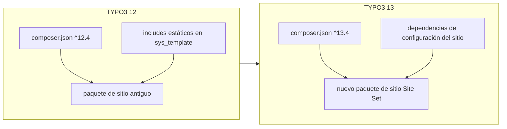

# Guía de actualización de TYPO3 12 → 13

Este documento describe una ruta práctica de actualización para un proyecto TYPO3 basado en Composer que utiliza un paquete de sitio personalizado con Bootstrap Package. El enfoque utilizado aquí es:

1. Mantener el paquete de sitio v12 existente como referencia.
2. Crear un **nuevo** paquete de sitio para v13 usando **Site Sets** (patrón de TYPO3 13 + Bootstrap Package 15).
3. Migrar los recursos y la configuración al nuevo paquete.
4. Actualizar las dependencias de Composer.
5. Cambiar la configuración del sitio de inclusiones estáticas de TypoScript a dependencias de Site Sets.
6. Desplegar con Git y `composer install --no-dev`.

La guía está escrita de forma genérica para que pueda reutilizarse en proyectos similares.

---

## Requisitos previos

Antes de comenzar:

- Proyecto TYPO3 **12.4** con un entorno local funcional (DDEV, Lando o equivalente).
- Un **escaneo de obsolescencias limpio** en el backend: **Herramientas de administración → Actualización → Escanear archivos de extensiones**.
- Una **copia de seguridad de la base de datos** inmediatamente antes de la actualización de Composer.
- PHP **8.2+** disponible localmente y en producción (requerido por Bootstrap Package 15).
- Repositorio Git para el proyecto principal y, normalmente, un repositorio separado para el paquete de sitio.

---

## Cambio de arquitectura: qué es diferente en v13

| TYPO3 12 (anterior) | TYPO3 13 (nuevo) |
|----------------------|------------------|
| Paquete de sitio registrado mediante TypoScript estático en `sys_template` | Paquete de sitio expuesto como un **Site Set** |
| Bootstrap Package 13.x | Bootstrap Package **15.x** |
| TypoScript en `Configuration/TypoScript/` | TypoScript dividido en archivos de Site Set bajo `Configuration/Sets/<NombreDelSet>/` |
| Page TS en `ext_localconf.php` o `Configuration/TsConfig/` | Page TS en `page.tsconfig` del Site Set |
| Constantes en `constants.typoscript` | Configuraciones en `settings.yaml` del Site Set |

Flujo general:



---

## Fase 1 — Preparar el nuevo paquete de sitio

Crear una nueva estructura de extensión para v13 (compatible con Site Sets). Mantener el paquete antiguo en su lugar hasta que la verificación esté completa.

### 1A. Estructura base del Site Set

En el nuevo paquete, crear como mínimo:

```
Configuration/Sets/<PaqueteDeSitio>/
  config.yaml       # nombre del set, etiqueta, dependencias
  settings.yaml     # antiguas constantes
  setup.typoscript  # antiguo setup
  page.tsconfig     # configuración de backend / Page TS
```

Ejemplo de `config.yaml`:

```yaml
name: vendor/my-site-package
label: 'My Site Package'
dependencies:
  - bootstrap-package/full
```

El `name` del Site Set debe coincidir con el identificador utilizado posteriormente en la lista de `dependencies` de la configuración del sitio.

También se puede recurrir a https://get.typo3.org/sitepackage para crear un paquete de sitio listo para usar.

### 1B. Migrar recursos públicos

Copiar del paquete de sitio antiguo al nuevo:

| Tipo de recurso | Origen típico | Notas |
|-----------------|---------------|-------|
| CSS personalizado | `Resources/Public/Css/` | Reglas de diseño específicas del proyecto |
| Íconos / favicons / manifiesto web | `Resources/Public/Icons/` | Actualizar claves de extensión codificadas |
| Imágenes | `Resources/Public/Images/` | Logotipos, SVGs, etc. |
| JavaScript | `Resources/Public/JavaScript/` | Migrar salida compilada o pipeline de compilación |
| Sobrecargas SCSS del tema | `Resources/Public/Scss/Theme/` | Colores de marca, variables de Bootstrap |

Reemplazar cada referencia `EXT:old_extension/` por `EXT:new_extension/`.

### 1C. Migrar plantillas privadas y formularios

| Elemento | Acción |
|----------|--------|
| Plantillas de página Fluid / partials / layouts | Copiar sobrecargas; comparar con los valores por defecto de Bootstrap Package 15 |
| Plantillas TWB de News | Copiar partials de lista/detalle/blog si se usan |
| Sobrecargas de elementos de contenido | Copiar y adaptar ViewHelpers para BP 15 si es necesario |
| YAML de formularios + FormSetup | Copiar `Resources/Private/Forms/` y `Configuration/Yaml/FormSetup.yaml` |

Eliminar la lógica de plantillas obsoleta vinculada a sitios o funcionalidades retiradas.

### 1D. Migrar código PHP

Si el paquete antiguo tiene middleware personalizado, controladores o listeners de eventos:

- Copiar las clases al nuevo namespace.
- Actualizar `Configuration/RequestMiddlewares.php` y la autocarga PSR-4 en `composer.json` / `ext_emconf.php`.
- Registrar presets de RTE en `ext_localconf.php` solo cuando sea necesario; preferir `page.tsconfig` del Site Set para Page TS.

**No** registrar archivos de TypoScript estático mediante `addStaticFile()` del TCA en v13 — los Site Sets reemplazan ese mecanismo.

### 1E. Migrar TypoScript a Site Sets

**`settings.yaml`** — absorber las antiguas constantes:

- Rutas y dimensiones de logotipos
- Variables SCSS de Bootstrap Package (`primary`, `secondary`, breakpoints)
- Rutas de plantillas de plugins (news, formularios, etc.)
- Toggles de funcionalidades que antes estaban en constantes

**`setup.typoscript`** — absorber el antiguo setup:

- Inclusiones de CSS/JS (Typekit, SCSS del tema, CSS personalizado, JS del footer)
- Registro de YAML de formularios
- Configuración de News (rutas de plantillas, anchos de imagen en listas, enlaces de registros)
- Configuración de SEO / proveedor de sitemap XML
- Fragmentos Fluid de favicon / headerData
- Variantes de imágenes responsivas
- Condiciones específicas de página — actualizar a la sintaxis de TYPO3 13, p. ej. `[page["uid"] == 22]` … `[END]`

**No** re-incluir el setup de Bootstrap Package manualmente; viene de la dependencia del Site Set `bootstrap-package/full`.

**`page.tsconfig`** — absorber el antiguo Page TS:

- Asignación de presets de RTE
- Definiciones de layouts del backend
- Sobrecargas de TCEFORM / TCEMAIN

### 1F. Metadatos de la extensión

Actualizar `ext_emconf.php`:

- Restricción de TYPO3: `13.4.0-13.99.99`
- Restricción de Bootstrap Package: `15.0.0-15.99.99`

Hacer commit y push del nuevo paquete de sitio a su propio repositorio Git cuando esté listo.

---

## Fase 2 — Actualización de dependencias de Composer

Editar el `composer.json` de la **raíz del proyecto**.

### Actualizaciones del core y paquetes de terceros

| Paquete | Desde (típico v12) | Hacia (v13) |
|---------|---------------------|-------------|
| Todos los `typo3/cms-*` | `^12.4` | `^13.4` |
| Paquete de sitio antiguo | `@dev` repositorio path | **eliminar** |
| Nuevo paquete de sitio | — | `@dev` vía repositorio path |
| `georgringer/news` | `^11.0` | `^13.0` o `^14.0` |
| `netresearch/rte-ckeditor-image` | 12.x | `^13.0` |
| `bk2k/bootstrap-package` | 13.x (transitivo) | `^15.0` (vía nuevo paquete de sitio) |
| `config.platform.php` | `8.1` | `8.2` |

Ejemplo de cambio de repositorio path:

```json
"repositories": [
  { "type": "composer", "url": "https://composer.typo3.org/" },
  { "type": "path", "url": "package/my-new-site-package" }
],
"require": {
  "vendor/my-new-site-package": "@dev",
  "typo3/cms-core": "^13.4"
}
```

### Scripts de Composer recomendados

Evitar ejecutar comandos CLI de TYPO3 que requieran conexión a la base de datos durante `composer install` (por ejemplo `cache:flush` en `post-autoload-dump`). En un despliegue nuevo en producción, `config/system/settings.php` podría no existir aún, lo que causa errores de DBAL.

Patrón seguro:

```json
"scripts": {
  "typo3-cms-scripts": [
    "typo3cms install:generatepackagestates",
    "typo3cms install:fixfolderstructure"
  ]
}
```

### Comandos de actualización local

```bash
# 1. Hacer copia de seguridad de la base de datos primero
# 2. Actualizar dependencias
composer update typo3/cms-* georgringer/news netresearch/rte-ckeditor-image bk2k/bootstrap-package --with-all-dependencies

# 3. Registrar extensiones y estructura de carpetas
vendor/bin/typo3 extension:setup
vendor/bin/typo3 install:fixfolderstructure
```

---

## Fase 3 — Configuración del sitio (Site Sets)

Editar `config/sites/<identificador-del-sitio>/config.yaml`.

Agregar un bloque `dependencies` que liste cada Site Set que el sitio necesita. El orden puede importar: colocar el **paquete de sitio del proyecto al final** para que sus configuraciones sobreescriban los valores por defecto de las extensiones.

Ejemplo:

```yaml
dependencies:
  - bootstrap-package/full
  - georgringer/news
  - georgringer/news-twb5
  - netresearch/rte-ckeditor-image
  - typo3/form
  - typo3/seo-sitemap
  - vendor/my-new-site-package
```

Revisar también al editar:

- Rutas de `webmanifest` / favicon → apuntar a la nueva clave de extensión
- Definiciones de rutas duplicadas (p. ej. sitemap) — eliminar las extras
- `routeEnhancers` para news — verificar después de la actualización de versión mayor de news

Después de cambiar la configuración del sitio, vaciar las cachés.

---

## Fase 4 — Migración de base de datos / TypoScript

Con los Site Sets activos, **eliminar las inclusiones estáticas heredadas de TypoScript** del registro raíz `sys_template` en la página raíz del sitio.

Valor típico anterior:

```
EXT:bootstrap_package/...,EXT:news/...,EXT:form/...,EXT:seo/...,EXT:old_site_package/Configuration/TypoScript
```

Objetivo:

- `include_static_file` vacío, **o**
- Solo inclusiones no cubiertas por dependencias de Site Sets (normalmente ninguna)

Asegurarse también de:

```sql
-- sys_template.clear debe ser 0 para que los Site Sets no se borren
UPDATE sys_template SET clear = 0 WHERE uid = <uid_del_template_raiz>;
```

Aplicar vía backend (**Web → Template**) o SQL controlado después de hacer copia de seguridad.

---

## Fase 5 — Asistentes de actualización y vaciado de caché

1. Abrir la Herramienta de instalación (`/typo3/install.php`) o usar los equivalentes por CLI.
2. Ejecutar **actualizaciones del esquema de base de datos**.
3. Ejecutar los asistentes de actualización específicos de extensiones (news, Bootstrap Package, rte-ckeditor-image, etc.).
4. Vaciar todas las cachés:

```bash
vendor/bin/typo3 cache:flush
```

Si el estilo de los elementos de contenido de Bootstrap Package falta después de la actualización, confirmar el orden de dependencias del Site Set y volver a verificar que el TypoScript de fluid-styled-content se carga vía dependencias.

---

## Fase 6 — Lista de verificación

| Área | Qué probar |
|------|------------|
| Página de inicio | Diseño, logotipo, CSS, JS |
| Listas de noticias | Todas las páginas de listado configuradas y route enhancers |
| Detalle de noticia | Segmentos de ruta y plantillas de detalle |
| Formularios | Flujo de envío y página de agradecimiento |
| SEO | `/sitemap.xml`, meta tags, extensión SEO en el backend |
| RTE | Inserción de imágenes con preset rte-ckeditor-image |
| Favicons / manifiesto PWA | Enlaces de íconos y URL del manifiesto |
| Backend | Inicio de sesión en `/typo3/`, módulo de Páginas, configuración del sitio |
| Manejo de errores | Página 404 y manejadores de errores configurados |

Vaciar cachés después de cada cambio importante durante las pruebas.

---

## Fase 7 — Dar de baja el paquete de sitio antiguo

Después de una verificación exitosa:

1. Eliminar el paquete de sitio antiguo del `composer.json` raíz (repositorio path + entrada en require).
2. Ejecutar `composer update` y `vendor/bin/typo3 extension:setup`.
3. Conservar el directorio del paquete antiguo como archivo local si es útil, luego eliminarlo cuando ya no sea necesario.

---

## Estructura del repositorio Git para despliegue

### Qué incluir en Git

| Rastrear | Ignorar |
|----------|---------|
| `composer.json`, `composer.lock` | `vendor/` |
| Configuración del sitio (`config/sites/`) | `var/` |
| Nuevo paquete de sitio como **submódulo** o checkout de repositorio path | `public/typo3temp/`, `public/_assets/` |
| `public/index.php` | Configuración local de DDEV / Docker (`.ddev/`) |
| `public/typo3/index.php`, `public/typo3/install.php` | `config/system/settings.php` (específico del entorno) |
| `public/.htaccess` (Apache) | Volcados de base de datos (`*.sql`, `*.sql.gz`) |
| `public/typo3conf/PackageStates.php` (opcional — puede regenerarse) | `public/fileadmin/` medios del usuario (depende del proyecto) |

Extracto de ejemplo de `.gitignore`:

```gitignore
/vendor/
/var/
/public/_assets/
/public/typo3/*
!/public/typo3/index.php
!/public/typo3/install.php
/public/typo3conf/ext/
/public/typo3temp/
/public/fileadmin/
.ddev/
config/system/settings.php
.DS_Store
```

### Paquete de sitio como submódulo de Git

Si el paquete de sitio vive en su propio repositorio:

```ini
# .gitmodules
[submodule "package/my-new-site-package"]
    path = package/my-new-site-package
    url = https://github.com/example/my-new-site-package.git
```

Hacer commit del puntero del submódulo en el proyecto principal después de cada release del paquete de sitio.

---

## Despliegue en producción

En el servidor en vivo:

```bash
git pull
git submodule update --init
composer install --no-dev --optimize-autoloader
vendor/bin/typo3 extension:setup
vendor/bin/typo3 install:fixfolderstructure
vendor/bin/typo3 cache:flush
```

Notas:

- Usar **`composer install --no-dev`** en producción para omitir paquetes exclusivos de desarrollo.
- Asegurarse de que `config/system/settings.php` exista en el servidor con las credenciales de la base de datos de producción (este archivo normalmente no está en Git).
- `vendor/` se recrea en cada despliegue a partir de `composer.lock`; no hacer commit de este directorio.
- No depender de `composer install` para vaciar las cachés a menos que la base de datos esté configurada primero.

### Servidor web: enrutamiento del backend

El frontend puede funcionar mientras que las subrutas del backend como `/typo3/login` devuelven 404 si el servidor web solo sirve el índice del directorio.

**Apache:** incluir el `public/.htaccess` de la plantilla de TYPO3 (Herramienta de instalación / `vendor/typo3/cms-install/Resources/Private/FolderStructureTemplateFiles/root-htaccess`).

**nginx:** agregar enrutamiento para las rutas del backend, por ejemplo:

```nginx
location = /typo3 {
    return 301 /typo3/;
}

location /typo3/ {
    try_files $uri /typo3/index.php$is_args$args;
}

location / {
    try_files $uri $uri/ /index.php$is_args$args;
}
```

Hasta que nginx esté configurado, la URL de inicio de sesión del backend **`/typo3/`** (con barra final) puede funcionar cuando `/typo3/login` no lo hace.

Recargar nginx después de cambios en la configuración:

```bash
sudo nginx -t && sudo systemctl reload nginx
```

---

## Orden de ejecución sugerido (resumen)

1. Hacer copia de seguridad de la base de datos.
2. Ejecutar el escaneo de obsolescencias (ya limpio → continuar).
3. Crear la estructura del nuevo paquete de sitio v13 con Site Sets.
4. Migrar recursos, plantillas, formularios, middleware, TypoScript, TSconfig y RTE del paquete antiguo.
5. Hacer commit y push del repositorio del nuevo paquete de sitio.
6. Actualizar el `composer.json` raíz para TYPO3 13 y las versiones mayores de extensiones.
7. Ejecutar `composer update` y `vendor/bin/typo3 extension:setup`.
8. Agregar las `dependencies` del Site Set al YAML de configuración del sitio.
9. Limpiar las inclusiones estáticas heredadas de TypoScript en el registro raíz `sys_template`.
10. Ejecutar los asistentes de la Herramienta de instalación y vaciar las cachés.
11. Verificar frontend, backend, noticias, formularios, SEO, RTE y favicons.
12. Eliminar el paquete de sitio antiguo de Composer.
13. Finalizar `.gitignore`, configuración de submódulos y artefactos de despliegue (`public/.htaccess`, puntos de entrada del backend, fragmento de nginx).
14. Desplegar con `git pull`, `git submodule update --init` y `composer install --no-dev`.

---

## Problemas comunes

| Síntoma | Causa probable | Solución |
|---------|----------------|----------|
| `composer install` falla en `cache:flush` | El script post-instalación se ejecuta antes de que la configuración de BD exista | Eliminar `cache:flush` de `post-autoload-dump`; ejecutar manualmente después del despliegue |
| `doctrine/annotations is abandoned` | Advertencia de dependencia transitiva | Inofensivo; no requiere acción |
| Falta el estilo de Bootstrap | Orden del Site Set o dependencia faltante | Colocar el paquete de sitio al final; verificar `bootstrap-package/full` |
| Backend `/typo3/login` 404 en nginx | Falta `try_files` para `/typo3/*` | Aplicar el fragmento de nginx; usar `/typo3/` temporalmente |
| Los Site Sets no se aplican | `sys_template.clear = 1` o inclusiones estáticas aún activas | Establecer `clear = 0`; vaciar `include_static_file` |
| 404 en formularios o favicon | La ruta aún apunta a la clave de extensión antigua | Buscar y reemplazar `EXT:old/` → `EXT:new/` |
| CKEditor falta en el backend; texto negro sobre tema oscuro | El Page TSconfig en la BD aún establece `RTE.default.preset = artmediagallery12` (extensión eliminada), o el YAML de preset personalizado rompe la inicialización de CKEditor | Eliminar la sobrecarga obsoleta de la BD; usar el preset `rteWithImages`; establecer preset a nivel de campo para bodytext |

**Verificar presets de RTE obsoletos en la base de datos:**

```sql
SELECT uid, title, tsconfig
FROM pages
WHERE deleted = 0
  AND tsconfig LIKE '%artmediagallery12%';

-- Eliminar bloque RTE obsoleto del TSconfig de la página raíz (el Site Set se encarga del RTE)
-- O reemplazar artmediagallery12 con rteWithImages / artmediagallery13
UPDATE pages
SET tsconfig = REPLACE(tsconfig, 'preset = artmediagallery12', 'preset = rteWithImages'),
    tstamp = UNIX_TIMESTAMP()
WHERE deleted = 0 AND tsconfig LIKE '%artmediagallery12%';
```

**El Page TSconfig del Site Set debe usar preset a nivel de campo** (porque `richtextConfiguration` del TCA puede tener precedencia sobre `RTE.default.preset` en algunos casos):

```typoscript
RTE {
    default.preset = rteWithImages
    config.tt_content.bodytext.preset = rteWithImages
}
```

---

## Referencias

- [Guía de actualización de TYPO3 13](https://docs.typo3.org/m/typo3/guide-installation/main/en-us/Upgrade/Index.html)
- [Instalación de Bootstrap Package 15](https://docs.typo3.org/p/bk2k/bootstrap-package/15.0/en-us/Installation/Index.html)
- [Site Sets de TYPO3](https://docs.typo3.org/m/typo3/reference-coreapi/main/en-us/ApiOverview/SiteSets/Index.html)
