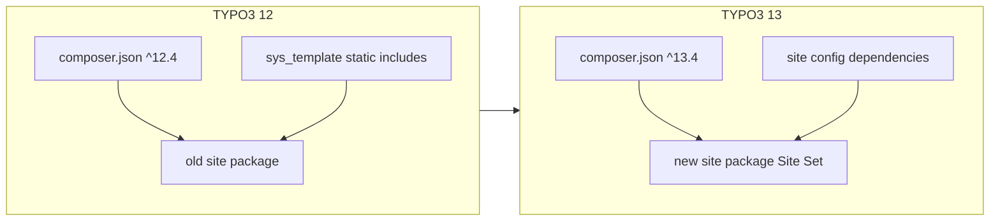

# TYPO3 12 → 13 Upgrade Guide

This document describes a practical upgrade path for a Composer-based TYPO3 project that uses a custom site package with Bootstrap Package. The approach used here is:

1. Keep the existing v12 site package as reference.
2. Create a **new** site package for v13 using **Site Sets** (TYPO3 13 + Bootstrap Package 15 pattern).
3. Port assets and configuration into the new package.
4. Bump Composer dependencies.
5. Switch the site configuration from static TypoScript includes to Site Set dependencies.
6. Deploy with Git and `composer install --no-dev`.

The guide is written generically so it can be reused on similar projects.

---

## Prerequisites

Before starting:

- TYPO3 **12.4** project with a working local environment (DDEV, Lando, or equivalent).
- A **clean deprecation scan** in the backend: **Admin Tools → Upgrade → Scan Extension Files**.
- A **database backup** immediately before the Composer bump.
- PHP **8.2+** available locally and on production (required by Bootstrap Package 15).
- Git repository for the main project and, typically, a separate repository for the site package.

---

## Architecture change: what is different in v13

| TYPO3 12 (old) | TYPO3 13 (new) |
|----------------|----------------|
| Site package registered via static TypoScript in `sys_template` | Site package exposed as a **Site Set** |
| Bootstrap Package 13.x | Bootstrap Package **15.x** |
| TypoScript in `Configuration/TypoScript/` | TypoScript split into Site Set files under `Configuration/Sets/<SetName>/` |
| Page TS in `ext_localconf.php` or `Configuration/TsConfig/` | Page TS in Site Set `page.tsconfig` |
| Constants in `constants.typoscript` | Settings in Site Set `settings.yaml` |

High-level flow:



---

## Phase 1 — Prepare the new site package

Create a new extension scaffold for v13 (Site Set capable). Keep the old package in place until verification is complete.

### 1A. Site Set skeleton

In the new package, create at minimum:

```
Configuration/Sets/<SitePackage>/
  config.yaml       # set name, label, dependencies
  settings.yaml     # former constants
  setup.typoscript  # former setup
  page.tsconfig     # backend / Page TS config
```

Example `config.yaml`:

```yaml
name: vendor/my-site-package
label: 'My Site Package'
dependencies:
  - bootstrap-package/full
```

The Site Set `name` must match the identifier used later in the site configuration `dependencies` list.

You may also resort to https://get.typo3.org/sitepackage to create a ready-made site package.

### 1B. Port public assets

Copy from the old site package to the new one:

| Asset type | Typical source | Notes |
|------------|----------------|-------|
| Custom CSS | `Resources/Public/Css/` | Project-specific layout rules |
| Icons / favicons / web manifest | `Resources/Public/Icons/` | Update hardcoded extension keys |
| Images | `Resources/Public/Images/` | Logos, SVGs, etc. |
| JavaScript | `Resources/Public/JavaScript/` | Port built output or build pipeline |
| SCSS theme overrides | `Resources/Public/Scss/Theme/` | Brand colors, Bootstrap variables |

Replace every `EXT:old_extension/` reference with `EXT:new_extension/`.

### 1C. Port private templates and forms

| Item | Action |
|------|--------|
| Fluid page templates / partials / layouts | Copy overrides; compare with Bootstrap Package 15 defaults |
| News TWB templates | Copy list/detail/blog partials if used |
| Content element overrides | Copy and adapt ViewHelpers for BP 15 if needed |
| Form YAML + FormSetup | Copy `Resources/Private/Forms/` and `Configuration/Yaml/FormSetup.yaml` |

Remove obsolete template logic tied to retired sites or features.

### 1D. Port PHP code

If the old package has custom middleware, controllers, or event listeners:

- Copy classes into the new namespace.
- Update `Configuration/RequestMiddlewares.php` and PSR-4 autoloading in `composer.json` / `ext_emconf.php`.
- Register RTE presets in `ext_localconf.php` only when needed; prefer Site Set `page.tsconfig` for Page TS.

Do **not** register static TypoScript files via TCA `addStaticFile()` in v13 — Site Sets replace that mechanism.

### 1E. Migrate TypoScript into Site Sets

**`settings.yaml`** — absorb old constants:

- Logo paths and dimensions
- Bootstrap Package SCSS variables (`primary`, `secondary`, breakpoints)
- Plugin template paths (news, forms, etc.)
- Feature toggles previously in constants

**`setup.typoscript`** — absorb old setup:

- CSS/JS includes (Typekit, theme SCSS, custom CSS, footer JS)
- Form YAML registration
- News configuration (template paths, list image widths, record links)
- SEO / XML sitemap provider configuration
- Favicon / headerData Fluid snippets
- Responsive image variants
- Page-specific conditions — update to TYPO3 13 syntax, e.g. `[page["uid"] == 22]` … `[END]`

Do **not** re-include Bootstrap Package setup manually; it comes from the `bootstrap-package/full` Site Set dependency.

**`page.tsconfig`** — absorb old Page TS:

- RTE preset assignment
- Backend layout definitions
- TCEFORM / TCEMAIN overrides

### 1F. Extension metadata

Update `ext_emconf.php`:

- TYPO3 constraint: `13.4.0-13.99.99`
- Bootstrap Package constraint: `15.0.0-15.99.99`

Commit and push the new site package to its own Git repository when ready.

---

## Phase 2 — Composer dependency upgrade

Edit the **project root** `composer.json`.

### Core and third-party bumps

| Package | From (typical v12) | To (v13) |
|---------|-------------------|----------|
| All `typo3/cms-*` | `^12.4` | `^13.4` |
| Old site package | `@dev` path repo | **remove** |
| New site package | — | `@dev` via path repository |
| `georgringer/news` | `^11.0` | `^13.0` or `^14.0` |
| `netresearch/rte-ckeditor-image` | 12.x | `^13.0` |
| `bk2k/bootstrap-package` | 13.x (transitive) | `^15.0` (via new site package) |
| `config.platform.php` | `8.1` | `8.2` |

Example path repository switch:

```json
"repositories": [
  { "type": "composer", "url": "https://composer.typo3.org/" },
  { "type": "path", "url": "package/my-new-site-package" }
],
"require": {
  "vendor/my-new-site-package": "@dev",
  "typo3/cms-core": "^13.4"
}
```

### Recommended Composer scripts

Avoid running TYPO3 CLI commands that need a database connection during `composer install` (for example `cache:flush` in `post-autoload-dump`). On a fresh production deploy, `config/system/settings.php` may not exist yet, which causes DBAL errors.

Safe pattern:

```json
"scripts": {
  "typo3-cms-scripts": [
    "typo3cms install:generatepackagestates",
    "typo3cms install:fixfolderstructure"
  ]
}
```

### Local upgrade commands

```bash
# 1. Backup database first
# 2. Update dependencies
composer update typo3/cms-* georgringer/news netresearch/rte-ckeditor-image bk2k/bootstrap-package --with-all-dependencies

# 3. Register extensions and folder structure
vendor/bin/typo3 extension:setup
vendor/bin/typo3 install:fixfolderstructure
```

---

## Phase 3 — Site configuration (Site Sets)

Edit `config/sites/<site-identifier>/config.yaml`.

Add a `dependencies` block listing every Site Set the site needs. Order can matter: put the **project site package last** so its settings override extension defaults.

Example:

```yaml
dependencies:
  - bootstrap-package/full
  - georgringer/news
  - georgringer/news-twb5
  - netresearch/rte-ckeditor-image
  - typo3/form
  - typo3/seo-sitemap
  - vendor/my-new-site-package
```

Also review while editing:

- `webmanifest` / favicon paths → point to the new extension key
- Duplicate route definitions (e.g. sitemap) — remove extras
- `routeEnhancers` for news — verify after the news major version bump

After changing site configuration, flush caches.

---

## Phase 4 — Database / TypoScript migration

With Site Sets active, **remove legacy static TypoScript includes** from the root `sys_template` record on the site root page.

Typical before value:

```
EXT:bootstrap_package/...,EXT:news/...,EXT:form/...,EXT:seo/...,EXT:old_site_package/Configuration/TypoScript
```

Target:

- Empty `include_static_file`, **or**
- Only includes not covered by Site Set dependencies (usually none)

Also ensure:

```sql
-- sys_template.clear must be 0 so Site Sets are not wiped
UPDATE sys_template SET clear = 0 WHERE uid = <root_template_uid>;
```

Apply via backend (**Web → Template**) or controlled SQL after backup.

---

## Phase 5 — Upgrade wizards and cache flush

1. Open the Install Tool (`/typo3/install.php`) or use CLI equivalents.
2. Run **database schema updates**.
3. Run extension-specific upgrade wizards (news, Bootstrap Package, rte-ckeditor-image, etc.).
4. Flush all caches:

```bash
vendor/bin/typo3 cache:flush
```

If Bootstrap Package content element styling is missing after upgrade, confirm Site Set dependency order and re-check that fluid-styled-content TypoScript is loaded via dependencies.

---

## Phase 6 — Verification checklist

| Area | What to test |
|------|----------------|
| Homepage | Layout, logo, CSS, JS |
| News lists | All configured list pages and route enhancers |
| News detail | Path segments and detail templates |
| Forms | Submit flow and thank-you page |
| SEO | `/sitemap.xml`, meta tags, SEO extension backend |
| RTE | Image insertion with rte-ckeditor-image preset |
| Favicons / PWA manifest | Icon links and manifest URL |
| Backend | `/typo3/` login, Page module, Site configuration |
| Error handling | 404 page and configured error handlers |

Flush caches after each major change during testing.

---

## Phase 7 — Decommission the old site package

After successful verification:

1. Remove the old site package from root `composer.json` (path repo + require entry).
2. Run `composer update` and `vendor/bin/typo3 extension:setup`.
3. Keep the old package directory as an archive locally if useful, then delete when no longer needed.

---

## Git repository layout for deployment

### What belongs in Git

| Track | Ignore |
|-------|--------|
| `composer.json`, `composer.lock` | `vendor/` |
| Site configuration (`config/sites/`) | `var/` |
| New site package as **submodule** or path repo checkout | `public/typo3temp/`, `public/_assets/` |
| `public/index.php` | Local DDEV / Docker config (`.ddev/`) |
| `public/typo3/index.php`, `public/typo3/install.php` | `config/system/settings.php` (environment-specific) |
| `public/.htaccess` (Apache) | Database dumps (`*.sql`, `*.sql.gz`) |
| `public/typo3conf/PackageStates.php` (optional — can be regenerated) | `public/fileadmin/` user media (project-dependent) |

Example `.gitignore` excerpt:

```gitignore
/vendor/
/var/
/public/_assets/
/public/typo3/*
!/public/typo3/index.php
!/public/typo3/install.php
/public/typo3conf/ext/
/public/typo3temp/
/public/fileadmin/
.ddev/
config/system/settings.php
.DS_Store
```

### Site package as Git submodule

If the site package lives in its own repository:

```ini
# .gitmodules
[submodule "package/my-new-site-package"]
    path = package/my-new-site-package
    url = https://github.com/example/my-new-site-package.git
```

Commit the submodule pointer in the main project after each site package release.

---

## Production deployment

On the live server:

```bash
git pull
git submodule update --init
composer install --no-dev --optimize-autoloader
vendor/bin/typo3 extension:setup
vendor/bin/typo3 install:fixfolderstructure
vendor/bin/typo3 cache:flush
```

Notes:

- Use **`composer install --no-dev`** on production to skip development-only packages.
- Ensure `config/system/settings.php` exists on the server with production database credentials (this file is usually not in Git).
- `vendor/` is recreated on each deploy from `composer.lock`; do not commit it.
- Do not rely on `composer install` to flush caches unless the database is configured first.

### Web server: backend routing

The frontend may work while backend subpaths such as `/typo3/login` return 404 if the web server only serves the directory index.

**Apache:** ship `public/.htaccess` from the TYPO3 template (Install Tool / `vendor/typo3/cms-install/Resources/Private/FolderStructureTemplateFiles/root-htaccess`).

**nginx:** add routing for backend paths, for example:

```nginx
location = /typo3 {
    return 301 /typo3/;
}

location /typo3/ {
    try_files $uri /typo3/index.php$is_args$args;
}

location / {
    try_files $uri $uri/ /index.php$is_args$args;
}
```

Until nginx is configured, the backend login URL **`/typo3/`** (with trailing slash) may work when `/typo3/login` does not.

Reload nginx after config changes:

```bash
sudo nginx -t && sudo systemctl reload nginx
```

---

## Suggested execution order (summary)

1. Back up the database.
2. Run the deprecation scan (already clean → proceed).
3. Scaffold the new v13 site package with Site Sets.
4. Port assets, templates, forms, middleware, TypoScript, TSconfig, and RTE from the old package.
5. Commit and push the new site package repository.
6. Update root `composer.json` for TYPO3 13 and extension major versions.
7. Run `composer update` and `vendor/bin/typo3 extension:setup`.
8. Add Site Set `dependencies` to the site configuration YAML.
9. Clear legacy static TypoScript includes on the root `sys_template` record.
10. Run Install Tool wizards and flush caches.
11. Verify frontend, backend, news, forms, SEO, RTE, and favicons.
12. Remove the old site package from Composer.
13. Finalize `.gitignore`, submodule setup, and deploy artifacts (`public/.htaccess`, backend entry points, nginx snippet).
14. Deploy with `git pull`, `git submodule update --init`, and `composer install --no-dev`.

---

## Common issues

| Symptom | Likely cause | Fix |
|---------|--------------|-----|
| `composer install` fails on `cache:flush` | Post-install script runs before DB config exists | Remove `cache:flush` from `post-autoload-dump`; run manually after deploy |
| `doctrine/annotations is abandoned` | Transitive dependency warning | Harmless; no action required |
| Missing Bootstrap styling | Site Set order or missing dependency | Put site package last; verify `bootstrap-package/full` |
| Backend `/typo3/login` 404 on nginx | Missing `try_files` for `/typo3/*` | Apply nginx snippet; use `/typo3/` temporarily |
| Site Sets not applied | `sys_template.clear = 1` or static includes still active | Set `clear = 0`; empty `include_static_file` |
| Form or favicon 404 | Path still points to old extension key | Search/replace `EXT:old/` → `EXT:new/` |
| CKEditor missing in backend; black bodytext on dark theme | Page TSconfig in DB still sets `RTE.default.preset = artmediagallery12` (removed extension), or custom preset YAML breaks CKEditor init | Remove stale DB override; use `rteWithImages` preset; set field-level preset for bodytext |

**Check for stale RTE preset in the database:**

```sql
SELECT uid, title, tsconfig
FROM pages
WHERE deleted = 0
  AND tsconfig LIKE '%artmediagallery12%';

-- Remove stale RTE block from root page TSconfig (Site Set handles RTE)
-- Or replace artmediagallery12 with rteWithImages / artmediagallery13
UPDATE pages
SET tsconfig = REPLACE(tsconfig, 'preset = artmediagallery12', 'preset = rteWithImages'),
    tstamp = UNIX_TIMESTAMP()
WHERE deleted = 0 AND tsconfig LIKE '%artmediagallery12%';
```

**Site Set Page TSconfig should use field-level preset** (because TCA `richtextConfiguration` can take precedence over `RTE.default.preset` in some cases):

```typoscript
RTE {
    default.preset = rteWithImages
    config.tt_content.bodytext.preset = rteWithImages
}
```

---

## References

- [TYPO3 13 Upgrade Guide](https://docs.typo3.org/m/typo3/guide-installation/main/en-us/Upgrade/Index.html)
- [Bootstrap Package 15 Installation](https://docs.typo3.org/p/bk2k/bootstrap-package/15.0/en-us/Installation/Index.html)
- [TYPO3 Site Sets](https://docs.typo3.org/m/typo3/reference-coreapi/main/en-us/ApiOverview/SiteSets/Index.html)
