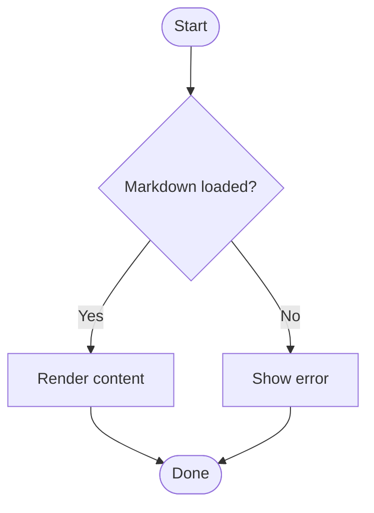
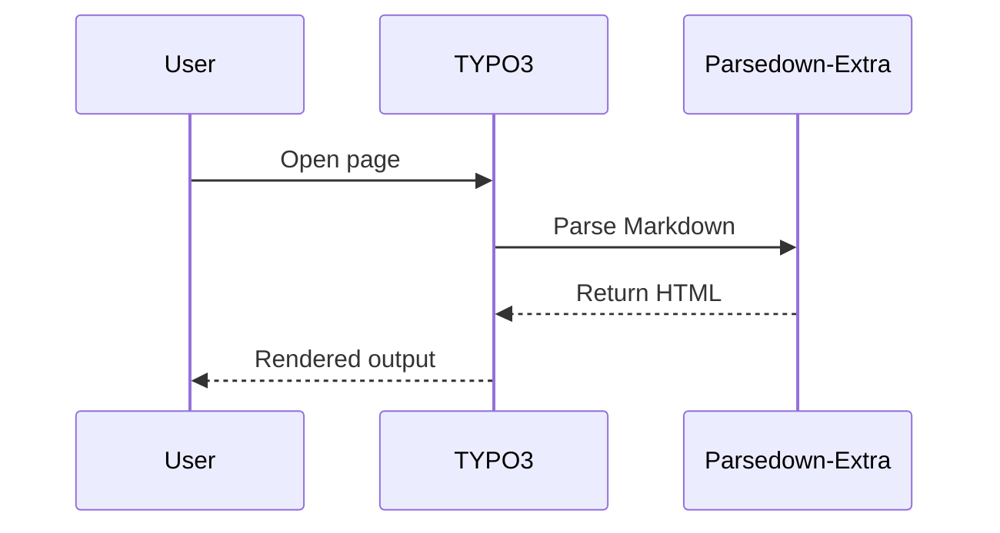
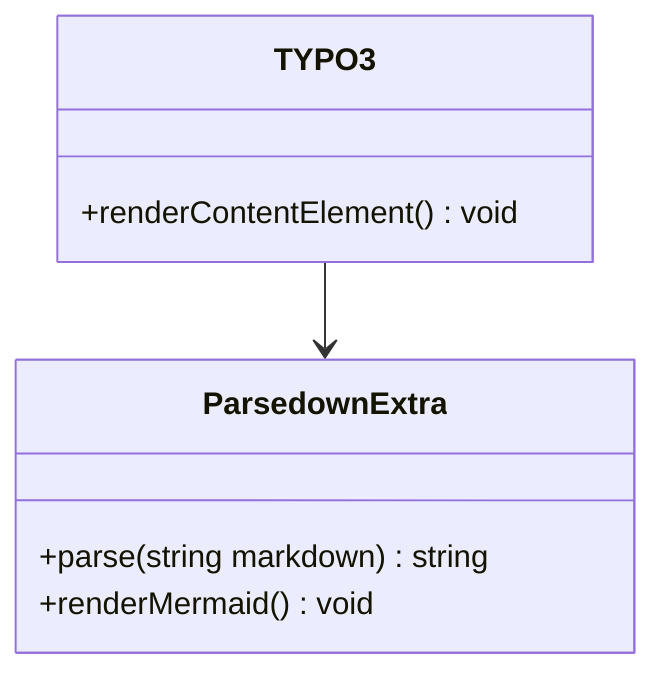
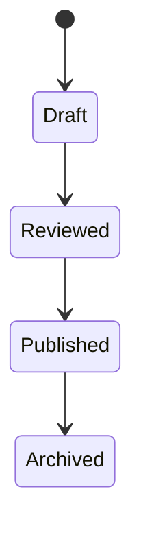
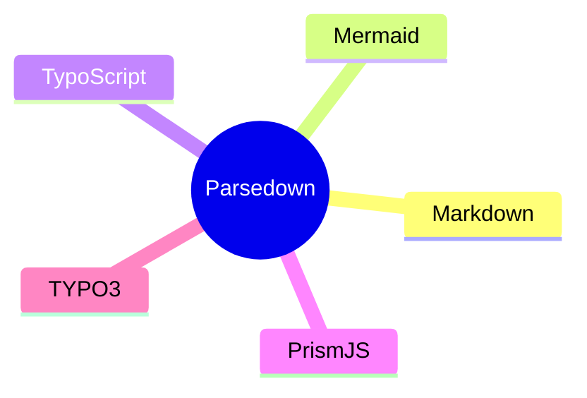

# Parsedown-Extra Test Document

This test file is intended to validate the rendering features of the Parsedown-Extra extension for TYPO3.

## Basic formatting

This is a paragraph with **bold text**, *italic text*, ***bold italic text***, `inline code`, and a manual line break.
This line should appear directly below the previous one.

---

## Headlines

# H1 Headline
## H2 Headline
### H3 Headline
#### H4 Headline
##### H5 Headline
###### H6 Headline

## Abbreviations

The following terms should support abbreviations in the rendered output: TYPO3, CSS, HTML, JS, BCC.

*[TYPO3]: TYPO3 - Content Management System

## Lists

### Unordered list

- First bullet
- Second bullet
	- Nested bullet
	- Another nested bullet
- Third bullet

### Ordered list

1. First item
2. Second item
3. Third item

### Task-like list

- [x] Finished item
- [ ] Open item

## Blockquotes

> #### Information: {.alert .alert-info}
>
> This is an informational message rendered as a Bootstrap-style blockquote.

> #### Warning: {.alert .alert-warning}
>
> This is a warning message for testing alert classes.

> #### Attention: {.alert .alert-danger}
>
> This is an error message for testing alert classes.

> #### Successful: {.alert .alert-success}
>
> This is a success message for testing alert classes.

## Tables

| Feature            | Status | Notes                          |
|-------------------|--------|--------------------------------|
| Markdown parsing  | OK     | Standard formatting supported  |
| Mermaid diagrams  | OK     | Requires Mermaid integration   |
| Syntax highlight  | OK     | PrismJS expected               |
| TypoScript code   | OK     | Custom language highlighting   |

## Links

This is an [inline link](https://www.coding.ms "coding.ms website") inside a paragraph.

A referenced link is used here: [coding.ms][link-codingms].

[link-codingms]: https://www.coding.ms/ "Title of the link"

Email link test: <typo3@coding.ms>

## Images

Below is a referenced image with an additional CSS class.

![Example image][module-filelist] {.img-fluid}

[module-filelist]: https://www.coding.ms/fileadmin/coding.ms/Images/parsedown-extra-dev-example-file-in-docs.png "coding.ms"

## Inline HTML

This includes <mark>highlighted HTML text</mark> and a <span class="badge bg-primary">badge-like span</span>.

## Code blocks

### PHP

```php
<?php

declare(strict_types=1);

namespace Vendor\Extension\Controller;

final class DemoController
{
    public function listAction(): string
    {
        return 'Hello TYPO3';
    }
}
```

### JavaScript

```javascript
document.addEventListener('DOMContentLoaded', () => {
    console.log('Parsedown test loaded');
});
```

### CSS

```css
.table-test tr:nth-child(4n) {
    background: #f5f5f5;
}
```

### JSON

```json
{
    "extension": "parsedown_extra",
    "supportsMermaid": true,
    "supportsSyntaxHighlighting": true
}
```

### TypoScript

```typo3_typoscript
plugin.tx_parsedownextra {
  settings {
    tableClass = table table-bordered table-striped table-hover table-sm
    linksAttr {
      class = internal-link
      target = _top
    }
    linksExternalAttr {
      class = external-link
      target = _blank
    }
    imagesAttr {
      loading = lazy
    }
  }
}
```

## Mermaid diagrams

### Flowchart



### Sequence diagram



### Class diagram



### State diagram



## Escaping and special characters

Use escaped characters like \*asterisks\*, \#hash, and \`backticks\` to ensure they are not interpreted as Markdown.

## Mixed content

Here is a paragraph with **bold text**, an [inline link](https://example.com), `inline code`, and a Mermaid reference below.



## Final section

If everything is rendered correctly, you should see formatted text, working links, image output, highlighted code blocks, styled tables, Bootstrap-like blockquotes, abbreviation handling, and Mermaid diagrams.
