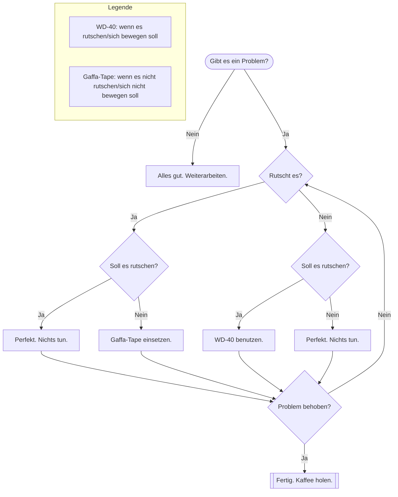

# Diagrams and charts with Mermaid

Just define a code-block with the `mermaid` language.

```markdown


This will render the following diagram:


More information:
- [Mermaid website](https://mermaid.js.org/)
- [Mermaid live editor](https://mermaid.live/)
