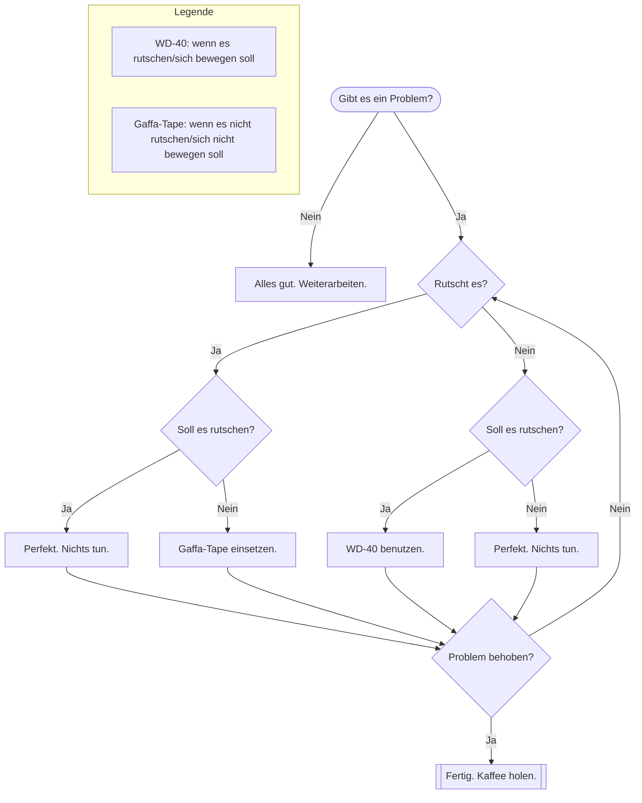

# Parsedown-Extra Extension for TYPO3

Provides a content element and ViewHelper which displays markdown files including Mermaid diagrams (UML, Activity, State and more). Parses email links with TYPO3 encryption. ViewHelper for parsing Markdown from individual sources. Defining abbreviations globally by using TypoScript. Code/Syntax Highlighting and many more.


**Features:**

*   Parse email links with TYPO3 encryption
*   Content-Element for selecting a Markdown file to parse and display the output
*   ViewHelper for parsing Markdown from individual sources
*   Defining abbreviations globally by using TypoScript
*   SourceCode syntax highlighting by using PrismJS
*   Syntax highlight for TypoScript
*   Diagrams and charts via MermaidJS

If you need some additional or custom feature - get in contact!


**Links:**

*   [TYPO3 Parsedown-Extra Documentation](https://www.coding.ms/documentation/typo3-parsedown-extra "Parsedown-Extra Documentation")
*   [TYPO3 Parsedown-Extra Bug-Tracker](https://gitlab.com/codingms/typo3-public/parsedown_extra/-/issues "Parsedown-Extra Bug-Tracker")
*   [TYPO3 Parsedown-Extra Repository](https://gitlab.com/codingms/typo3-public/parsedown_extra "Parsedown-Extra Repository")
*   [TYPO3 Parsedown-Extra Productdetails](https://www.coding.ms/de/typo3-extensions/typo3-parsedown-extra/ "TYPO3 Parsedown-Extra Productdetails")
*   [TYPO3 Parsedown-Extra Documentation](https://www.coding.ms/documentation/typo3-parsedown-extra "TYPO3 Parsedown-Extra Documentation")
*   [Markdown Syntax](https://daringfireball.net/projects/markdown/syntax "Markdown Syntax")
*   [Parsedown Website](http://parsedown.org/ "Parsedown Website")
*   [Parsedown-Extra Website](https://michelf.ca/projects/php-markdown/extra/ "Parsedown-Extra Website")
*   [Mermaid Diagramming and charting tool](https://mermaid.js.org/ "Mermaid Diagramming and charting tool")

## TypoScript constant settings


### General

| **Constant**      | styles.content.imgtext.linkWrap.lightboxEnabled                |
| :---------------- | :------------------------------------------------------------- |
| **Label**         | Enable LightBox for content elements/images                    |
| **Description**   |                                                                |
| **Type**          | Selectbox with options: 0, 1                                   |
| **Default value** | 1                                                              |

| **Constant**      | styles.content.imgtext.linkWrap.lightboxCssClass               |
| :---------------- | :------------------------------------------------------------- |
| **Label**         | CSS class for lightbox                                         |
| **Description**   |                                                                |
| **Type**          | string                                                         |
| **Default value** | lightbox                                                       |

| **Constant**      | styles.content.imgtext.linkWrap.lightboxRelAttribute           |
| :---------------- | :------------------------------------------------------------- |
| **Label**         | CSS relation attribute for lightbox                            |
| **Description**   |                                                                |
| **Type**          | string                                                         |
| **Default value** | lightbox[{field:uid}]                                          |

| **Constant**      | themes.configuration.lightbox.colorbox.theme                   |
| :---------------- | :------------------------------------------------------------- |
| **Label**         | LightBox theme, possible values 1-5                            |
| **Description**   |                                                                |
| **Type**          | Selectbox with options: 1, 2, 3, 4, 5                          |
| **Default value** | 2                                                              |

| **Constant**      | themes.configuration.lightbox.colorbox.cssUrl                  |
| :---------------- | :------------------------------------------------------------- |
| **Label**         | Base url for CSS theme                                         |
| **Description**   |                                                                |
| **Type**          | string                                                         |
| **Default value** | https://cdnjs.cloudflare.com/ajax/libs/jquery.colorbox/1.4.33/ |

| **Constant**      | themes.configuration.lightbox.colorbox.jsUrl                   |
| :---------------- | :------------------------------------------------------------- |
| **Label**         | Base url for Script                                            |
| **Description**   |                                                                |
| **Type**          | string                                                         |
| **Default value** | https://cdnjs.cloudflare.com/ajax/libs/jquery.colorbox/1.4.33/ |


## Available plugins

This extension contains following plugins, which can be placed on your website.


### 


## Abbreviations in Parsedown-Extra for TYPO3

Parsedown-Extra enables you to define case-sensitive abbreviations. You can define abbreviations in the following two ways.

### Defining in markdown file

If you like to define a new abbreviations only for a single file, you can use the following markdown:

```markdown
*[TYPO3]: TYPO3 - Content Management System
```

### Defining globally for all markdown renderings

If you need a abbreviations definition for all markdown renderings in your system, you can define them by using TypoScript. These TypoScript defined abbreviations are available in all parse processes of the Parsedown-Extra TYPO3-Extension. A definition for that looks like:

```typo3_typoscript
plugin.tx_parsedownextra {
  settings {
    abbreviations {
      101 {
        search = CSS
        value = Cascading Style Sheet
      }
      102 {
        search = HTML
        value = Hyper Text Markup Language
      }
      103 {
        search = JS
        value = JavaScript
      }
      104 {
        search = BCC
        value = Blind carbon copy
      }
    }
  }
}
```


## Blockquotes

### Notices, Warnings and more by using blockquotes

Warnings, notices, information and more can be displayed like this:

```markdown
>	#### Information: {.alert .alert-info}
>
>	This is the message...
```

Because we're applying the Bootstrap-Styles, you can set *success*, *danger*, *warning* and *info*.


### Examples


#### Info message box

>	#### Information: {.alert .alert-info}
>
>	This is the message...


#### Error message box

>	#### Attention: {.alert .alert-danger}
>
>	This is the message...


## Configuring the HTML-Rendering in Parsedown-Extra for TYPO3

### Defining CSS classes for HTML table tags

You can simply add own CSS classes to the HTML table tags by using the following TypoScript:

```typo3_typoscript
plugin.tx_parsedownextra {
  settings {
    tableClass = table table-bordered table-striped table-hover table-sm Test
  }
}
```


### Defining attributes for links

You can simply add own attributes to the HTML a tags by using the following TypoScript:

```typo3_typoscript
plugin.tx_parsedownextra {
  settings {
    linksAttr {
      class = interal-link
      target = _top
    }
  }
}
```


### Defining attributes for external links

You can simply add own attributes to the HTML a tags by using the following TypoScript:

```typo3_typoscript
plugin.tx_parsedownextra {
  settings {
    linksExternalAttr {
      class = external-link
      target = _blank
    }
  }
}
```


### Defining attributes for images

You can simply add own attributes to the HTML img tags by using the following TypoScript:

```typo3_typoscript
plugin.tx_parsedownextra {
  settings {
    imagesAttr {
      loading = lazy
    }
  }
}
```


## Images in Parsedown-Extra for TYPO3

Define image as reference:

```markdown
[module-filelist]: https://www.domain.de/fileadmin/Documentation/Images/Module/filelist.png "Dateilisten-Modul"
```

Using image:

```markdown
Stet clita kasd gubergren, no sea takimata sanctus est Lorem ipsum dolor sit amet.
![Filelist-Module][module-filelist] {.inline-image}
Stet clita kasd gubergren, no sea takimata sanctus est Lorem ipsum dolor sit amet.
```


## Links in Parsedown-Extra for TYPO3

### Defining links as reference:

```markdown
[link-codingms]: https://www.coding.ms/  "Title of the link"
```

Usage:

```markdown
Lorem ipsum [Label of the link][link-codingms] and some more text.
```

Result:

Lorem ipsum [Label of the link][link-codingms] and some more text.
[link-codingms]: https://www.coding.ms/  "Title of the link"


>	#### Information: {.alert .alert-info}
>
>	You are able to modify the link attributes by TypoScript configuration. Read more about that in section *HTML-Rendering*.


### Defining inline links:

```markdown
Read [here](https://www.ampproject.org/learn/overview/#video "This is the title of the a-tag!") how AMP works in detail.
```


## Diagrams and charts with Mermaid

Just define a code-block with the `mermaid` language.

```markdown


This will render the following diagram:


More information:
- [Mermaid website](https://mermaid.js.org/)
- [Mermaid live editor](https://mermaid.live/)


## First Headline

Minions ipsum tatata bala tu pepete jeje baboiii chasy potatoooo wiiiii. La bodaaa tank yuuu! Tulaliloo bappleees poulet tikka masala la bodaaa tulaliloo la bodaaa. Bananaaaa ti aamoo! Underweaaar underweaaar belloo! Me want bananaaa! Chasy gelatooo jiji. Poopayee me want bananaaa! Belloo! Pepete po kass wiiiii po kass. Me want bananaaa! ti aamoo! Baboiii bee do bee do bee do hana dul sae bananaaaa baboiii bappleees gelatooo. Tatata bala tu pepete jiji hana dul sae. Underweaaar butt bappleees daa belloo! Bananaaaa potatoooo daa poopayee belloo! Hahaha poopayee hana dul sae underweaaar potatoooo pepete tank yuuu! Poulet tikka masala hahaha.


### Second Headline

Minions ipsum tatata bala tu pepete jeje baboiii chasy potatoooo wiiiii. La bodaaa tank yuuu! Tulaliloo bappleees poulet tikka masala la bodaaa tulaliloo la bodaaa. Bananaaaa ti aamoo! Underweaaar underweaaar belloo! Me want bananaaa! Chasy gelatooo jiji. Poopayee me want bananaaa! Belloo! Pepete po kass wiiiii po kass. Me want bananaaa! ti aamoo! Baboiii bee do bee do bee do hana dul sae bananaaaa baboiii bappleees gelatooo. Tatata bala tu pepete jiji hana dul sae. Underweaaar butt bappleees daa belloo! Bananaaaa potatoooo daa poopayee belloo! Hahaha poopayee hana dul sae underweaaar potatoooo pepete tank yuuu! Poulet tikka masala hahaha.


### Second Headline

Minions ipsum tatata bala tu pepete jeje baboiii chasy potatoooo wiiiii. La bodaaa tank yuuu! Tulaliloo bappleees poulet tikka masala la bodaaa tulaliloo la bodaaa. Bananaaaa ti aamoo! Underweaaar underweaaar belloo! Me want bananaaa! Chasy gelatooo jiji. Poopayee me want bananaaa! Belloo! Pepete po kass wiiiii po kass. Me want bananaaa! ti aamoo! Baboiii bee do bee do bee do hana dul sae bananaaaa baboiii bappleees gelatooo. Tatata bala tu pepete jiji hana dul sae. Underweaaar butt bappleees daa belloo! Bananaaaa potatoooo daa poopayee belloo! Hahaha poopayee hana dul sae underweaaar potatoooo pepete tank yuuu! Poulet tikka masala hahaha.


#### Third Headline

Minions ipsum tatata bala tu pepete jeje baboiii chasy potatoooo wiiiii. La bodaaa tank yuuu! Tulaliloo bappleees poulet tikka masala la bodaaa tulaliloo la bodaaa. Bananaaaa ti aamoo! Underweaaar underweaaar belloo! Me want bananaaa! Chasy gelatooo jiji. Poopayee me want bananaaa! Belloo! Pepete po kass wiiiii po kass. Me want bananaaa! ti aamoo! Baboiii bee do bee do bee do hana dul sae bananaaaa baboiii bappleees gelatooo. Tatata bala tu pepete jiji hana dul sae. Underweaaar butt bappleees daa belloo! Bananaaaa potatoooo daa poopayee belloo! Hahaha poopayee hana dul sae underweaaar potatoooo pepete tank yuuu! Poulet tikka masala hahaha.

*   Minions ipsum tatata bala tu pepete jeje baboiii chasy potatoooo wiiiii.
*   La bodaaa tank yuuu!
*   Tulaliloo bappleees poulet tikka masala la bodaaa tulaliloo la bodaaa.
*   Bananaaaa ti aamoo! Underweaaar underweaaar belloo! Me want bananaaa! Chasy gelatooo jiji. Poopayee me want bananaaa! Belloo! Pepete po kass wiiiii po kass. Me want bananaaa! ti aamoo! Baboiii bee do bee do bee do hana dul sae bananaaaa baboiii bappleees gelatooo. Tatata bala tu pepete jiji hana dul sae. Underweaaar butt bappleees daa belloo! Bananaaaa potatoooo daa poopayee belloo! Hahaha poopayee hana dul sae underweaaar potatoooo pepete tank yuuu!
*   Poulet tikka masala hahaha.

Minions ipsum tatata bala tu pepete jeje baboiii chasy potatoooo wiiiii. La bodaaa tank yuuu! Tulaliloo bappleees poulet tikka masala la bodaaa tulaliloo la bodaaa. Bananaaaa ti aamoo! Underweaaar underweaaar belloo! Me want bananaaa! Chasy gelatooo jiji. Poopayee me want bananaaa! Belloo! Pepete po kass wiiiii po kass. Me want bananaaa! ti aamoo! Baboiii bee do bee do bee do hana dul sae bananaaaa baboiii bappleees gelatooo. Tatata bala tu pepete jiji hana dul sae. Underweaaar butt bappleees daa belloo! Bananaaaa potatoooo daa poopayee belloo! Hahaha poopayee hana dul sae underweaaar potatoooo pepete tank yuuu! Poulet tikka masala hahaha.

1.  Minions ipsum tatata bala tu pepete jeje baboiii chasy potatoooo wiiiii.
2.  La bodaaa tank yuuu!
3.  Tulaliloo bappleees poulet tikka masala la bodaaa tulaliloo la bodaaa.
4.  Bananaaaa ti aamoo! Underweaaar underweaaar belloo! Me want bananaaa! Chasy gelatooo jiji. Poopayee me want bananaaa! Belloo! Pepete po kass wiiiii po kass. Me want bananaaa! ti aamoo! Baboiii bee do bee do bee do hana dul sae bananaaaa baboiii bappleees gelatooo. Tatata bala tu pepete jiji hana dul sae. Underweaaar butt bappleees daa belloo! Bananaaaa potatoooo daa poopayee belloo! Hahaha poopayee hana dul sae underweaaar potatoooo pepete tank yuuu!
5.  Poulet tikka masala hahaha.


### Blockquotes

>	#### Successful: {.alert .alert-success}
>
>	Minions ipsum tatata bala tu pepete jeje baboiii chasy potatoooo wiiiii. La bodaaa tank yuuu!

>	#### Information: {.alert .alert-info}
>
>	Minions ipsum tatata bala tu pepete jeje baboiii chasy potatoooo wiiiii. La bodaaa tank yuuu!

>	#### Attention: {.alert .alert-danger}
>
>	Minions ipsum tatata bala tu pepete jeje baboiii chasy potatoooo wiiiii. La bodaaa tank yuuu!

>	#### Warning: {.alert .alert-warning}
>
>	Minions ipsum tatata bala tu pepete jeje baboiii chasy potatoooo wiiiii. La bodaaa tank yuuu!


*[TYPO3]: TYPO3 - Content Management System


## Suggestions for well formed documentations


### Breadcrumbs

`Startseite -> Daten -> Pressebereich -> Downloads`


## Translations

Following you'll find an overview about all translations for the frontend of this extension and a description on how to customize them.


### Override translation values

The translation values can be easily overwritten by the following Setup-TypoScript:

```typo3_typoscript
plugin.tx_parsedownextra._LOCAL_LANG {
    default {
        tx_parsedownextra_label.example_key = Example value
    }
    en {
        tx_parsedownextra_label.example_key = Example value
    }
    de {
        tx_parsedownextra_label.example_key = Beispiel-Wert
    }
}
```

For the label of the pro extension it must be like this:

```typo3_typoscript
plugin.tx_parsedownextrapro._LOCAL_LANG {
    default {
        tx_parsedownextra_label.example_key = Example value
    }
    en {
        tx_parsedownextra_label.example_key = Example value
    }
    de {
        tx_parsedownextra_label.example_key = Beispiel-Wert
    }
}
```


### Translation overview

| Key                                                        | Extension       | en                          | de                          |
| ---------------------------------------------------------- | --------------- | --------------------------- | --------------------------- |
| tx_parsedownextra_exception.parsedown_parser_not_found     | parsedown_extra | Parsedown parser not found! | Parsedown parser not found! |
| tx_parsedownextra_message.warning_parsedown_file_not_found | parsedown_extra | Parsedown file not found!   | Parsedown file not found!   |


## Parsedown Extra Change-Log

### 2026-04-29 Release of version 5.0.1

*	[TASK] Optimize and rebuild documentation


### 2026-04-28 Release of version 5.0.0

*	[TASK] Migrate for TYPO3 14 and remove support for TYPO3 12
*	[TASK] Add or update PHP doc comment for classes
*	[TASK] Migrate and normalize upgrade-wizards
*	[BUGFIX] Fix email rendering for TYPO3 13 and 14


### 2026-04-17 Release of version 4.3.8

*	[BUGFIX] Fix TypoScript identifier for mermaid-init JavaScript


### 2026-04-17 Release of version 4.3.7

*	[BUGFIX] Fix translation in new-content-element-wizard
*	[BUGFIX] Fix content-element registration


### 2026-03-26 Release of version 4.3.6

*	[TASK] Add site set configuration


### 2026-03-09 Release of version 4.3.5

*	[TASK] Add documentation about translations


### 2026-02-11 Release of version 4.3.4

*	[BUGFIX] Avoid inserting Markdown tab in all content elements


### 2026-01-27 Release of version 4.3.3

*	[TASK] Switch methods from protected to private in the final DrawItem class
*	[TASK] Code clean up and quality improvements


### 2025-10-20 Release of version 4.3.2

*	[TASK] Move jQuery libraries into footer


### 2025-10-20 Release of version 4.3.1

*	[TASK] Add jQuery as an optional static include
*	[TASK] Insert a more complex Mermaid example in the documentation


### 2025-10-13 Release of version 4.3.0

*	[FEATURE] Add markdown from an editor in content-element
*	[TASK] Add Nermaid into TER description


### 2025-10-11 Release of version 4.2.2

*	[TASK] Code clean up


### 2025-10-10 Release of version 4.2.1

*	[BUGFIX] Fix version definition


### 2025-10-10 Release of version 4.2.0

*	[FEATURE] Add Mermaid diagram support


### 2025-09-08 Release of version 4.1.2

*	[BUGFIX] Add forceOnTop for Prism JavaScript library, so that it is loaded before the other libraries


### 2025-08-29 Release of version 4.1.1

*	[TASK] Update developer section in documentation
*	[TASK] Add or update PHP doc comment for classes
*	[TASK] Add translations.json file for documentation
*	[BUGFIX] Set a unique upgrade wizard identifier


### 2025-05-26 Release of version 4.1.0

*	[BUGFIX] Fix colleting attributes for links and images, so that all defined CSS classes remains
*	[BUGFIX] Fix building links in TYPO3 13
*	[BUGFIX] Fix usage of translated files in content-element
*	[BUGFIX] Fix sorting of backend file selection
*	[FEATURE] Provide an optional selection for a markdown file by FAL
*	[TASK] Optimize code style


### 2025-04-14 Release of version 4.0.2

*	[TASK] Migrate to plugins to content elements and icon registration
*	[BUGFIX] Fix new content element wizards for TYPO3 12


### 2025-02-18 Release of version 4.0.1

*	[BUGFIX] Fix deprecation notice for nullable method parameter
*	[TASK] Mark compatible with PHP 8.4


### 2024-11-27 Release of version 4.0.0

*	[TASK] Migrate to TYPO3 13, remove support for TYPO3 11
*	[TASK] Migrate TypoScript imports


### 2024-07-08 Release of version 3.0.5

*	[BUGFIX] Fix PHP parent class issue by updating ParseDown-Extra library
*	[TASK] Optimize version conditions in PHP code
*	[TASK] Code style optimization


### 2023-11-01 Release of version 3.0.4

*	[TASK] Clean up documentation
*	[BUGFIX] Fix get content object for TYPO3 11


### 2023-10-27 Release of version 3.0.3

*	[BUGFIX] Fix access on non defined ctype index in backend preview


### 2023-08-18 Release of version 3.0.2

*	[TASK] Migration of tt_content_drawItem hook for TYPO3 12


### 2023-08-16 Release of version 3.0.1

*	[TASK] Add more documentation


### 2023-08-08 Release of version 3.0.0

*	[TASK] Migrate to TYPO3 12 and remove support for TYPO3 10


### 2022-11-29 Release of Version 2.3.2

*	[BUGFIX] Fix insecure js library loading


### 2022-11-20 Release of Version 2.3.1

*	[BUGFIX] Fix attributes and classes for HTML table rendering


### 2022-11-07 Release of Version 2.3.0

*	[FEATURE] Insert configuration for image tag attributes
*	[BUGFIX] Fix PHP warnings for PHP 8.0


### 2022-09-09 Release of Version 2.2.0

*	[TASK] Upgrade Parsedown Extra Plugin


### 2022-08-18 Release of Version 2.1.3

*	[TASK] Optimize documentation metadata


### 2022-05-09 Release of Version 2.1.2

*	[BUGFIX] Fix selected markdown item in backend flexform
*	[TASK] Clean up ext_tables.php
*	[TASK] Update of the parsedown/extra/plugin libraries
*	[TASK] Add missing documentation file for styleguide


### 2022-04-09 Release of Version 2.1.1

*	[TASK] Move backend icon into Resources/Public/Icons
*	[TASK] Add content object into Fluid template


### 2022-02-07 Release of Version 2.1.0

*	[TASK] Insert a Styleguide Documentation page
*	[TASK] Code clean up
*	[TASK] Extend and validate documentations configuration
*	[TASK] Add documentations configuration
*	[TASK] Drop support for TYPO3 9
*	[TASK] Rise PHP version to 7.4
*	[TASK] Preparations for TYPO3 11


### 2021-02-19 Release of Version 2.0.2

*	[BUGFIX] Handle only relative files in markdown selection


### 2021-02-18 Release of Version 2.0.1

*	[BUGFIX] Fix file selection in content element


2021-02-14 Release of Version 2.0.0

*	[TASK] Migration for TYPO3 10


2021-01-07 Release of Version 1.5.3

*	[TASK] Add extra tags in composer.json
*	[TASK] Add german translation


### 2020-11-13 Release of Version 1.5.2

*	[BUGFIX] Check if markdown file exists in parsedown ViewHelper


### 2020-11-13 Release of Version 1.5.1

*	[TASK] Change extra tags


### 2020-11-13 Release of Version 1.5.0

*	[TASK] Disable Record storage page and Recursive in tt_content
*	[FEATURE] Viewhelper file attribute


### 2020-06-25 Release of Version 1.4.2

*	[TASK] Update extra tags in composer.json
*	[TASK] Update description in ext_emconf.php


### 2020-06-04 Release of Version 1.4.1

*	[TASK] Add extra tags in composer.json
*	[BUGFIX] Fix version in ext_emconf.php


### 2020-05-25 Release of Version 1.4.0

*	[TASK] Cleanup Change-Log


### 2020-01-13 Release of version 1.3.0

*	[FEATURE] Add parameter for shift HTML headlines
*	[FEATURE] Add parameter for disable email protection


### 2019-11-01 Release of version 1.2.2

*	[TASK] Add Gitlab-CI configuration.


### 2019-11-01 Release of version 1.2.1

*	[BUGFIX] Fix warning in TCA overrides.
*	[TASK] Changing links inside documentation.
*	[TASK] Remove DEV identifier.
*	[BUGFIX] Fixing argument type in Parsedown ViewHelper.


### 2019-01-21 Release of version 1.2.0

*	[TASK] Migration for TYPO3 9.5.


### 2018-10-24 Release of version 1.1.2

*	[BUGFIX] Fixing pass configuration from TypoScript.


### 2018-10-10 Release of version 1.1.1

*	[BUGFIX] Fixing array iteration of abbreviations.


### 2018-10-03 Release of version 1.1.0

*	[TASK] Moving abbreviations configuration into TypoScript settings.
*	[FEATURE] Adding configuration for CSS classes in HTML table tags.
*	[FEATURE] Adding configuration for Link attributes in HTML a tags.
*	[TASK] Working on documentation.
*	[TASK] Removing FlexForm and using DB-Field for selected Markdown files.
*	[TASK] Moving JavaScript into Footer
*	[FEATURE] Add page module preview
*	[TASK] Add icon as SVG
*	[FEATURE] Add parseing for email links with TYPO3 encryption
*	[TASK] Add a parse ViewHelper


### 2017-06-25 Release of version 1.0.0

*	[TASK] Development of first version


